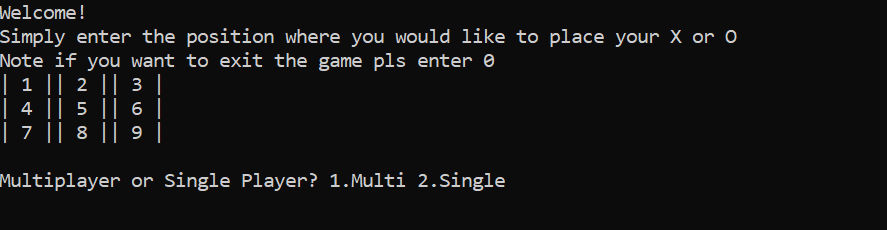
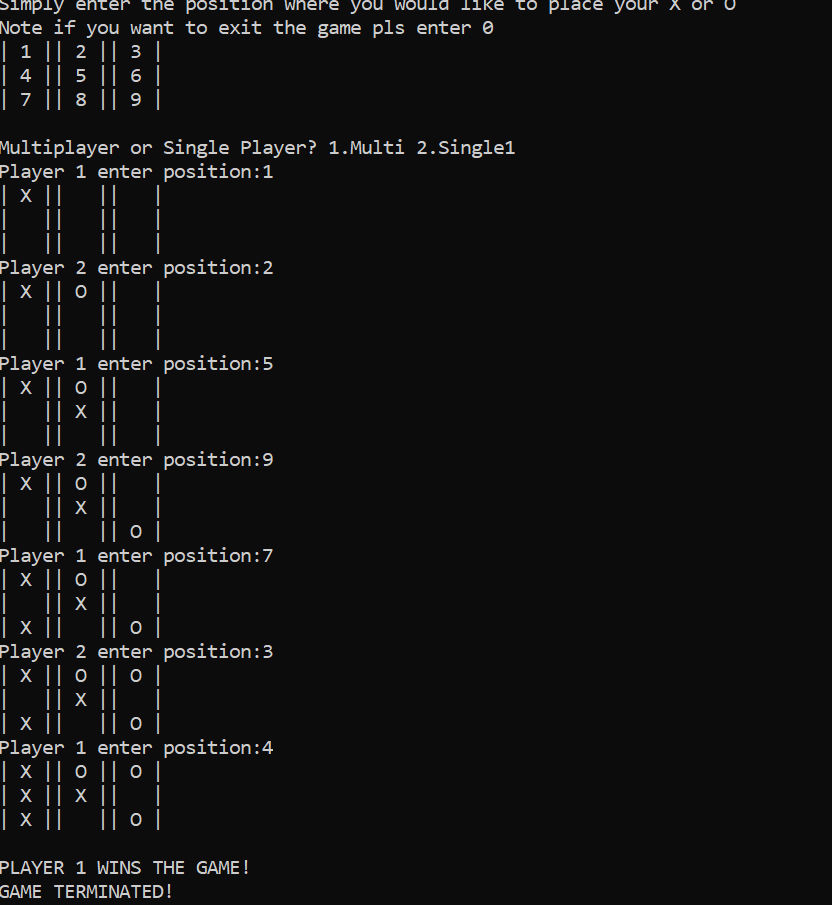
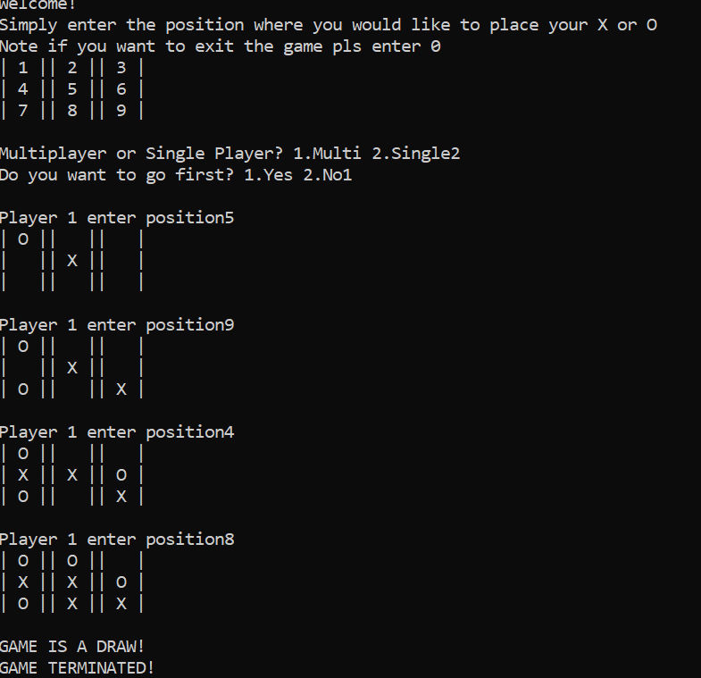
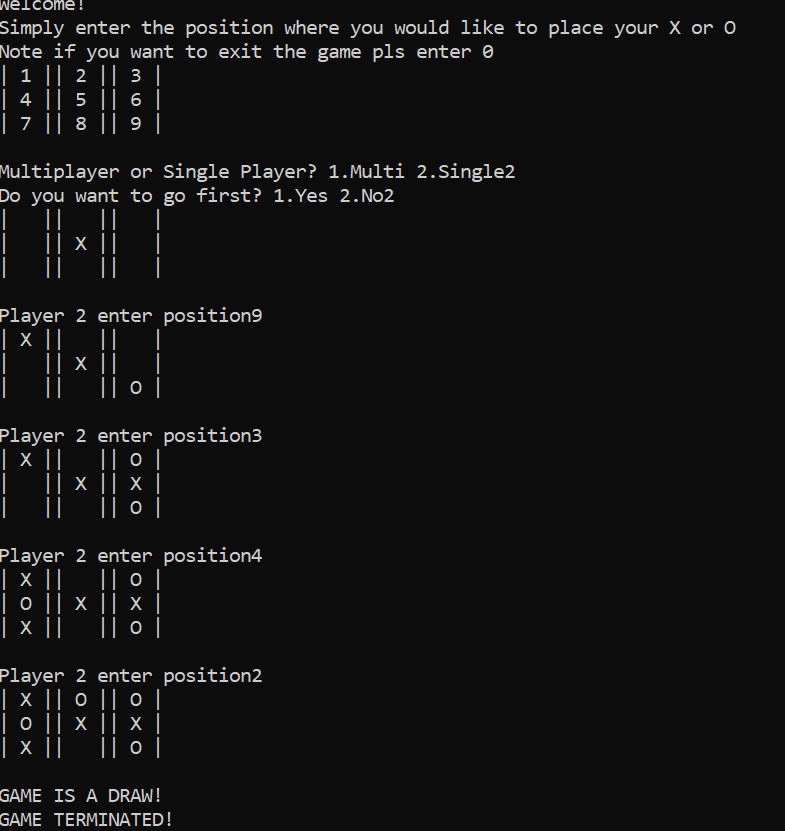

# Tic Tac Toe Game(Simple Display)
 The source code is in C++ and the game will run on a Windows console. The game board is a 3x3 matrix displayed with labels from 1-9. At each step the game state is displayed with Xs and Os. It provides the user an option between Single and Multiplayer. 
 

At any point in the game, the program may be terminated by entering 0.

## Multiplayer Mode

In the Multiplayer option, two players may enter the label values of the matrix to see their entry on the board at each move. 

##### A Two Player Game Example

## Singleplayer Mode

When the user selects the single player option, they are asked for the choice between playing first or second.

Note that the single player computer is desgined to be unbeatable. So the user will always be able to draw if they play perfectly.

##### If Player Goes First

Similar result occurs when the user plays after the computer.

##### If Player Goes Second

Further details on the source code documentation is in the README.txt file. 

